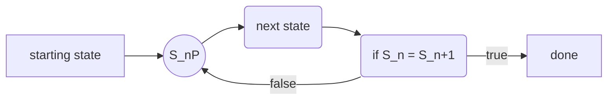
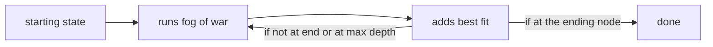

# flavor town food prediction models

This is a continuation and refinement of the Flavor Town food predictor. This is built off the work of several others, who are added as contributors and can see and edit this if they wish. Thank you to all involved in making the original flavor town project for the 2026 NMSU hackathon. This repo only contains models and other code to run the predictions the ui code is not contained in this repo, the data set that we used to make the models is this [https://www.kaggle.com/datasets/realalexanderwei/food-com-recipes-with-ingredients-and-tags?resource=download](https://www.kaggle.com/datasets/realalexanderwei/food-com-recipes-with-ingredients-and-tags?resource=download)

## new models
#### markov chain based predictor
a stochastic model that forecasts future states based solely on the current state, assuming the future is independent of the past (memorylessness). It utilizes a transition matrix, where $S_nP=S_{n+1}$ to calculate the probability of moving between defined states we use this to predict the next ingredent to add 

the the intuition in this case is that givn a state we can make  the chane settel and plot the state transitions the global maximim will represent a good addition 

#### updated fog of war search
a graph search algorithm that finds the shortest path from a single source node to all other nodes in a weighted graph with non-negative edge weights, This also uses a logistic regression model to predict a candidate. This makes the model very expensive and hard to fully use, as the computations are long and redundant

This also uses a logistic regression model to predict a candidate. This makes the model very expensive and difficult to use fully, as the computations are lengthy and redundant. The model contains 2 vectors.

[context] + [candidit vector]

The vectors contain a PCA vector derived from a sparse ingredient vector.

# getting stared 

you will need to download the dataset [https://www.kaggle.com/datasets/realalexanderwei/food-com-recipes-with-ingredients-and-tags?resource=download](https://www.kaggle.com/datasets/realalexanderwei/food-com-recipes-with-ingredients-and-tags?resource=download)
